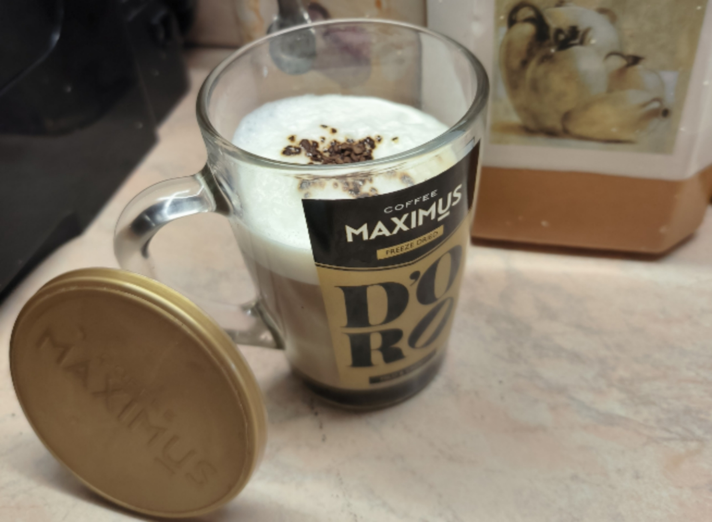

- 👋 Hi, I’m @YaroStrike
- 👀 I’m interested in silence!
- 🌱 I’m currently learning Full-time second course of informational systems & programming
- ("2ISP-6" GROUP)
- 💞️ I’m looking to collaborate on ... IT programs for example 💀
- 📫 How to reach me ...  ☠ 
- 😄 Pronouns: HE/HIS
- ⚡ Fun fact: sorry i need to go on lesson about math🥱

YaroStrike/YaroStrike is a ✨ special ✨ repository because its `README.md` (this file) appears on YaroStrike GitHub profile.
You can click the Preview link to take a look at your changes.

